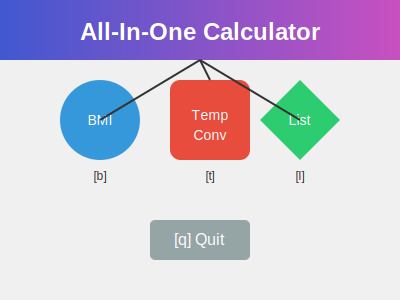

# All-In-One Calculator



## Description

All-In-One Calculator is a versatile Python application that combines multiple useful tools into a single, easy-to-use interface. This project showcases modular programming, input handling, and various mathematical operations in Python.

## Features

- Body Mass Index (BMI) Calculator
- Temperature Converter (Fahrenheit to Celsius or Kelvin)
- List Operations (for both numbers and strings)

## How to Use

1. Run the script:
   ```
   python All_IN_ONE_CALCULATOR.py
   ```

2. Choose from the main menu:
   - `b` for BMI Calculator
   - `t` for Temperature Conversion
   - `l` for List Operations
   - `q` to Quit

3. Follow the prompts for each tool:

   ### BMI Calculator
   - Enter your height in cm
   - Enter your weight in kg
   - Receive your BMI and a health status message

   ### Temperature Converter
   - Enter temperature in Fahrenheit
   - Choose to convert to Celsius or Kelvin

   ### List Operations
   - Choose between number lists or string lists
   - For number lists:
     - Enter list elements
     - Choose to add, subtract, or multiply lists
   - For string lists:
     - Enter list elements
     - Concatenate two lists

## Example Usage

```
All in one Calculator!

Name: Abhay Prasanna Rao

MAIN MENU: [b]BMI Calculator, [t]Temperature conversion, [l] play with lists or [q]uit?: b

Enter your height(in cm ): 170
Enter your weight (in Kg): 70

Your Body Mass Index is:  24.221453287197232

You are fit and healthy! 

MAIN MENU: [b]BMI Calculator, [t]Temperature conversion, [l] play with lists or [q]uit?: t

Enter the temperature in Fahrenheit: 98.6
Do you want to convert it into Celcius[c] or kelvin [k]: c
In Celcius, it's 37.0 degrees.

MAIN MENU: [b]BMI Calculator, [t]Temperature conversion, [l] play with lists or [q]uit?: q
Have a good Day....Bye! 

```

## Technologies Used

- Python 3
- Standard Python libraries

## Future Improvements

- Graphical user interface (GUI)
- Additional calculator functions (e.g., scientific calculator)
- Data persistence to save user's previous calculations
- Unit conversion for various metrics
- Improved error handling and input validation

## Author

Abhay Prasanna Rao
